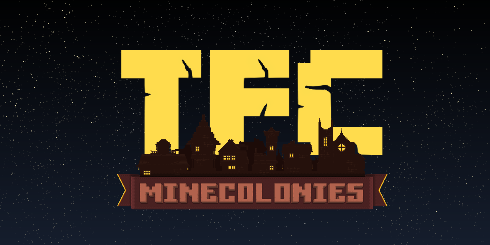

# TFC Minecolonies Compatibility Addon

This mod attempts to provide seemless compatibility between TerraFirmaCraft and Minecolonies.
It heavily modifies internal Minecolonies code, expanding on its features and adding support for
aspects of TFC's gameplay that doesn't exist in Vanilla.

Currently, the mod will focus on standard TFC. Future support for other addons may be created in
the future.

## Progress Overview

 - [X] Recipes for Structurize items
 - [X] Minecolonies Advancements
 - [X] Recipes for Domum Ornamentum
 - [X] Block compatibilities with Domum Ornamentum
 - [X] Recipe for multi-piston
 - [X] Recipes for Minecolonies
 - [ ] Custom schematic(s) for Minecolonies
 - [ ] Custom functionality/integration for Minecolonies
 - [ ] TFC block/entity/item tag compatibility (See [here](https://terrafirmacraft.github.io/Documentation/1.18.x/data/))
 - [ ] Minecolonies tag compatibility (See [here](https://wiki.minecolonies.ldtteam.com/source/tutorials/datapacks))

(See GitHub issues for more detailed progress)

## License

GPLv3.0 - see [License](./LICENSE) for details.

## Contributing

This is mod under heavy development and very far from a playable alpha. 

To get involved please join our [Discord Server](https://discord.gg/u2Ztpykver)

## Authors

 - natrow
 - Gaffgarion
